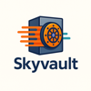
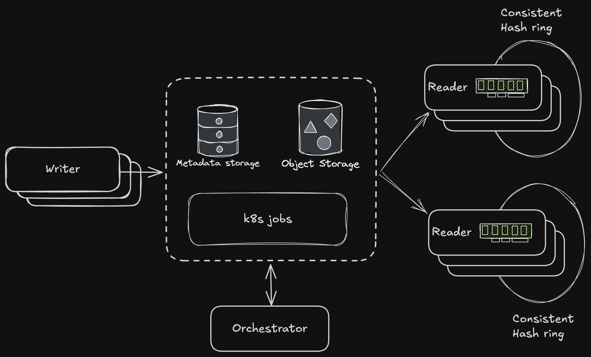

Skyvault is a high-performance, scalable object-store backed key-value store.

## Architecture

## Technologies Used

| Technology                                   | Description                                                   |
|----------------------------------------------|---------------------------------------------------------------|
| [Tonic](https://github.com/hyperium/tonic)   | High performance gRPC framework for Rust                      |
| [PostgreSQL](https://www.postgresql.org/)    | Open source relational database                               |
| [SQLx](https://github.com/launchbadge/sqlx)  | Async SQL toolkit for Rust                                    |
| [MinIO](https://min.io/)                     | High performance object storage                               |
| [Kubernetes](https://kubernetes.io/)         | Container orchestration platform                              |
| [Helm](https://helm.sh/)                     | Package manager for Kubernetes                                |
| [Docker](https://www.docker.com/)            | Container platform                                            |
| [Cursor Editor](https://cursor.sh/)          | AI-powered code editor used for development                   |

## Prerequisites

- Rust (nightly)
- Protobuf compiler (protoc)
- Docker, k8s and helm for local development
- [Just](https://github.com/casey/just) command runner

## Getting Started

1. Clone the repository
2. Run `just deploy` to start everything in k8s

## Security

See our [Security Policy](SECURITY.md) for reporting security vulnerabilities.

## License

This project is licensed under the terms in the [LICENSE](LICENSE) file.
