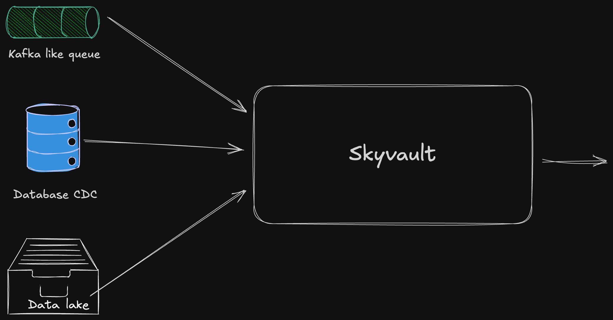
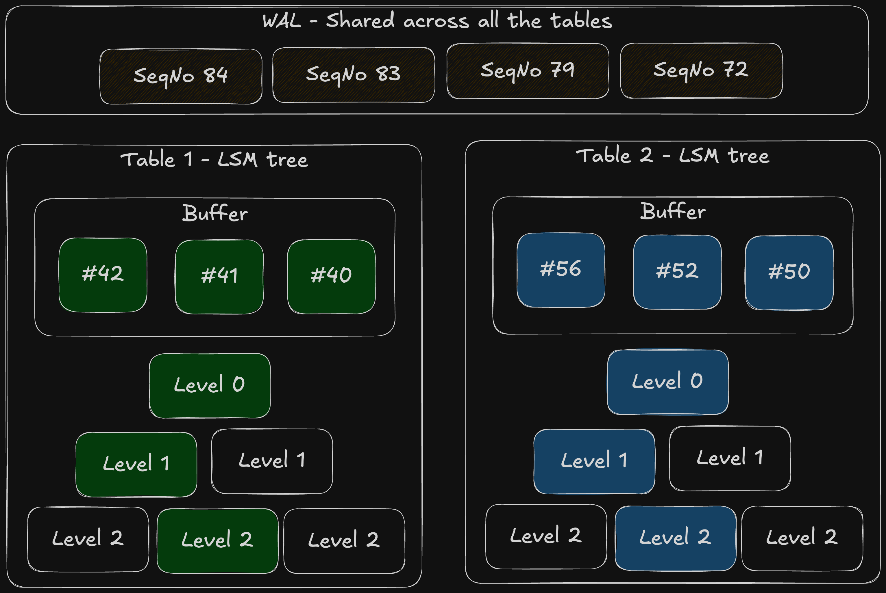

Skyvault is a high-performance, scalable object-store backed key-value store.

## Architecture

## Usage

Skyvault is supposed to be the low latency high QPS serving layer for your data. Imagine an AI application 
computing features in some offline system and then loading them to skyvault to serve them on the live path. 

## Data organization

Skyvault is supposed to be single tenant system. Idea is for each tenant you will deploy it to a new k8s namespace.
In each deployment, key-values are organized by table. You can write and read from multiple tables in a single query
at a given snapshot. This way you can build secondary indexes by writing to primary/indexes table atomically.

**Write path**

Writes are batched across tables until the batch reaches a certain size or until we hit a timeout. Once batch is ready, 
it is written to **Write ahead log (WAL)**.

**Read path**

On reads, we take a snapshot of the whole LSM tree and merge values across 
- All Write ahead log runs. 
- All the table buffer runs.
- One run at each level of the table LSM tree.

**Background compactions**

Orchestrator is constantly firing k8s jobs that are pushing data down from 
- WAL -> Table buffers
- Table buffers -> Table LSM tree
- Table LSM tree levels

## Database schema

**Runs**

`run` represents a SST file in the objectstore that makes up our LSM tree. Its immutable and once associated
with the tree in a certain location it never changes. 

**Changelog**

Changelog represents the changes we are making to the `forest` (WAL and all the table LSM tree are collectively called forest).

**Snapshots**

To avoid changelog from going forever, we periodically snapshot the `forest` state and dump it in object store.
To load current state of forest, reading latest `snapshot` and the `changelog` since the snapshot should give you the full picture.

**Tables**

Stores table configuration like time-to-live, max LSM tree levels and so on. 

**Jobs**

Used to track background jobs for observability.

## Technologies Used

| Technology                                   | Description                                                   |
|----------------------------------------------|---------------------------------------------------------------|
| **Production**                               |                                                               |
| [Tonic](https://github.com/hyperium/tonic)   | High performance gRPC framework for Rust                      |
| [PostgreSQL](https://www.postgresql.org/)    | Open source relational database                               |
| [SQLx](https://github.com/launchbadge/sqlx)  | Async SQL toolkit for Rust                                    |
| [Kubernetes](https://kubernetes.io/)         | Container orchestration platform                              |
| [Helm](https://helm.sh/)                     | Package manager for Kubernetes                                |
| [Sentry](https://sentry.io/)                 | Error tracking and performance monitoring                     |
| **Development only**                         |                                                               |
| [Minikube](https://minikube.sigs.k8s.io/)    | Local Kubernetes implementation                               |
| [MinIO](https://min.io/)                     | High performance object storage                               |
| [Docker](https://www.docker.com/)            | Container platform                                            |
| [Cursor Editor](https://cursor.sh/)          | AI-powered code editor used                                   |
| [Just](https://github.com/casey/just)        | Command runner for development tasks                          |

## Prerequisites

- Rust (nightly)
- Protobuf compiler (protoc)
- Docker, k8s, minikube cluster, just and helm for local development
- PostgreSQL instance database for SQLx compile-time query checking

## Getting Started

1. Run `just build` to build skyvault and push container image to minikube.
2. Run `just deploy` to start everything in k8s.
3. Run `just smoke` to run some simple smoke tests against this.

## Security

See our [Security Policy](SECURITY.md) for reporting security vulnerabilities.

## License

This project is licensed under the terms in the [LICENSE](LICENSE) file.
