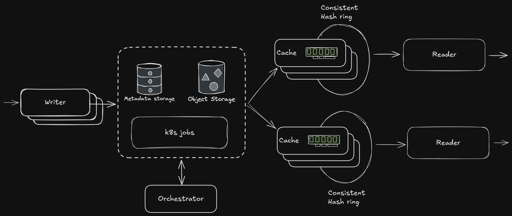

Skyvault is a high-performance, scalable object-store backed key-value store.

## Architecture

## Usage

Skyvault is supposed to be the low latency high QPS serving layer for your data. Imagine an AI application 
computing features in some offline system and then loading them to skyvault to serve them on the live path. 

## Technologies Used

| Technology                                   | Description                                                   |
|----------------------------------------------|---------------------------------------------------------------|
| **Production**                               |                                                               |
| [Tonic](https://github.com/hyperium/tonic)   | High performance gRPC framework for Rust                      |
| [PostgreSQL](https://www.postgresql.org/)    | Open source relational database                               |
| [SQLx](https://github.com/launchbadge/sqlx)  | Async SQL toolkit for Rust                                    |
| [Kubernetes](https://kubernetes.io/)         | Container orchestration platform                              |
| [Helm](https://helm.sh/)                     | Package manager for Kubernetes                                |
| [Sentry](https://sentry.io/)                 | Error tracking and performance monitoring                     |
| **Development only**                         |                                                               |
| [Minikube](https://minikube.sigs.k8s.io/)    | Local Kubernetes implementation                               |
| [MinIO](https://min.io/)                     | High performance object storage                               |
| [Docker](https://www.docker.com/)            | Container platform                                            |
| [Cursor Editor](https://cursor.sh/)          | AI-powered code editor used                                   |
| [Just](https://github.com/casey/just)        | Command runner for development tasks                          |

## Prerequisites

- Rust (nightly)
- Protobuf compiler (protoc)
- Docker, k8s, minikube cluster, just and helm for local development
- PostgreSQL instance database for SQLx compile-time query checking

## Getting Started

1. Run `just build` to build skyvault and push container image to minikube.
2. Run `just deploy` to start everything in k8s.
3. Run `just smoke` to run some simple smoke tests against this.

## Security

See our [Security Policy](SECURITY.md) for reporting security vulnerabilities.

## License

This project is licensed under the terms in the [LICENSE](LICENSE) file.
